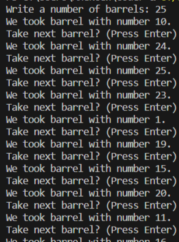

# Applied Coding 9
## Исполнитель    
Фадеев Алексей    
группа ФТ-220007    
## Лабораторная работа №9 - Логирование    
В мешке с бочонками N бочек (от 1 до N).    
Нажатие кнопки – вытаскивание очередного бочонка из мешка.    
Вытянутые бочонки убираем в сторону (т.е. каждое число может выпасть только 1 раз).    
Написать на любом языке программу, реализующую данную задачу.    
Код программы должен содержать комментарии для созданных функций и основных блоков, а также качественный диалог с пользователем для минимизации отказов при неправильном вводе.    
## Среда разработки    
Язык программирования: Python.    
Среда разработки: Visual Studio Code.    
## Инструкция по работе    
Входные данные: натуральное число N.    
Выходные данные: последовательность чисел от 1 до N в случайном порядке (по нажатию клавиши).    
## Тесты    
Тест 1    
    
Тест 2    
    
Тест 3    
    
  
